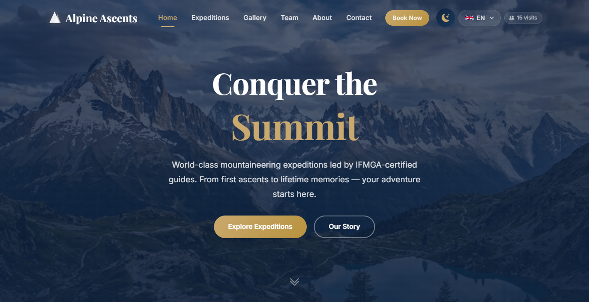
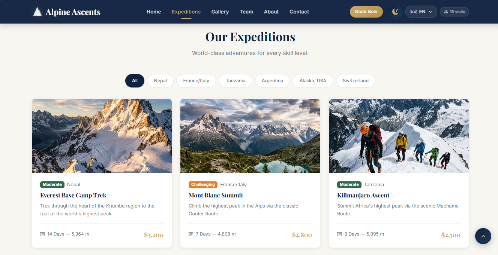
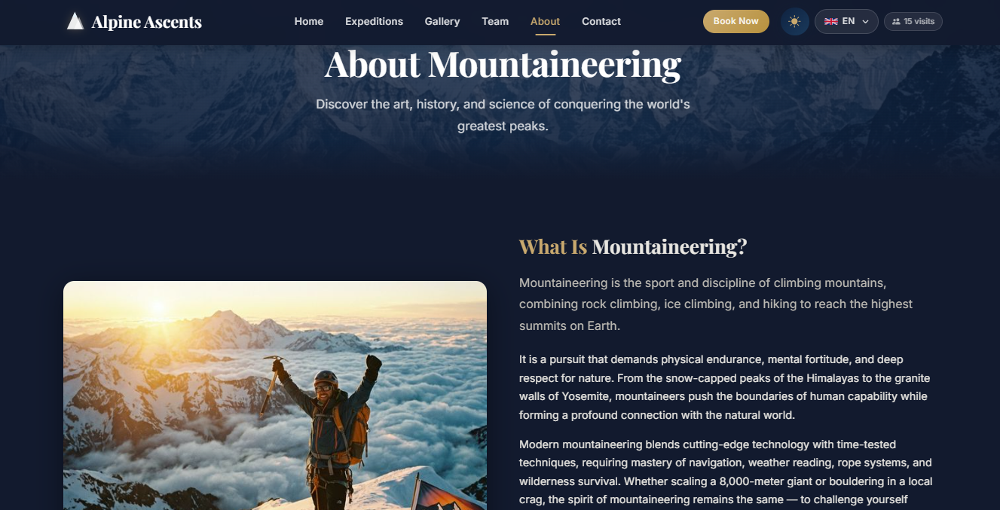

# Alpine Ascents - Mountain Expeditions Platform

Alpine Ascents is a high-performance, multi-page React application built for mountaineering enthusiasts. This platform provides an immersive experience for users to explore peaks, gear up for expeditions, and book their next climbing adventure.

## Live Demo
**[View Alpine Ascents Live](https://alpineascentsmountaineering.netlify.app/)**

## Project Overview
This project serves as a comprehensive showcase of modern frontend architecture. It features dynamic page routing, a dual-theme design system, and full internationalization (i18n) support to cater to a global audience of climbers.

## Key Features
* **Multi-Page Architecture:** Fully routed experience featuring Home, Destinations, Equipment, Booking, Gallery, About, and Contact pages.
* **Internationalization (i18n):** Multi-language support allowing users to switch languages seamlessly.
* **Dynamic Theme Toggling:** High-fidelity Light and Dark modes implemented via React Context.
* **Mobile-First Design:** Fully responsive layouts optimized for all device sizes.
* **Optimized Performance:** Fast-loading assets and a modular component structure powered by Vite.

## UI Showcase & Snapshots
### 1. Hero Experience

*A high-impact landing page designed to inspire adventure.*

### 2. Expedition Details

*Clean layouts showcasing various peaks and climbing packages.*

### 3. Theme Customization

*Demonstrating the dynamic Light/Dark mode implementation.*

## Tech Stack
* **Core:** React.js, Vite
* **Routing:** React Router DOM
* **State Management:** React Context API
* **Internationalization:** i18next (i18n)
* **Styling:** Modern CSS (Flexbox/Grid)
* **Deployment:** Netlify

## Project Structure
The codebase is organized modularly for scalability and maintainability:

```text
Alpine Ascents/
├── public/                 # Static assets
│   ├── images/             # Global images
│   └── vite.svg            # Favicon
├── snapshot_README/        # Documentation assets (images/videos)
├── src/                    # Application source code
│   ├── assets/             # Component-specific media and icons
│   ├── components/         # Reusable UI elements (Navbar, Footer, Buttons)
│   ├── context/            # Global state (Theme toggling logic)
│   ├── data/               # Mock data for expeditions and gallery
│   ├── locales/            # Translation files for multi-language support
│   ├── pages/              # Route components (Home, Destinations, etc.)
│   ├── App.jsx             # Main application layout and routing
│   ├── i18n.js             # Internationalization configuration
│   ├── index.css           # Global stylesheets
│   └── main.jsx            # Application entry point
├── .gitignore              # Ignored files for Git
├── eslint.config.js        # Linter configuration
├── index.html              # HTML template
├── package.json            # Dependencies and scripts
└── vite.config.js          # Vite build configuration